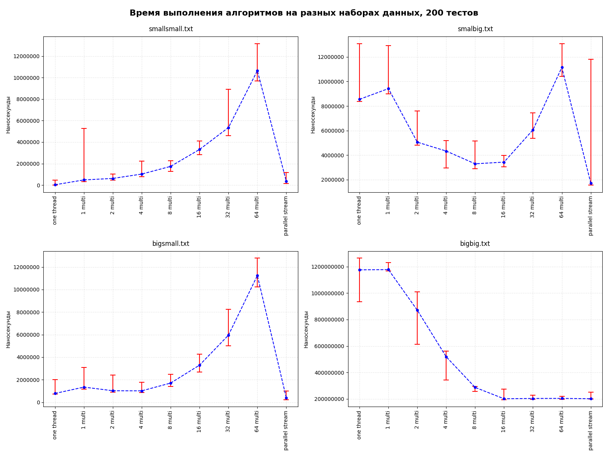

#### Задача
В данной задаче реализованы 3 алгоритма
поиска составного числа в массиве простых чисел.

Алгоритм получает на вход массив чисел и выдает
в качестве резальтата true - если составное число
найдено, иначе false

(а) seq    -
(б) thread -
(в) stream -

#### Исследование скорости поиска
Проведено исследование скорости работы этих алгоритмов.
Для этого были сгенерированы 4 набора чисел:
1. smallsmall - массив длины 64 состоящий из чисел 101
2. smallbig - массив длины 100 000 состоящий из чисел 101
3. bigsmall - массив длины 64 состоящий из чисел 1000003
4. long-large - массив длины 100 000 состоящий из чисел 1000003

#### Исследование
Произведено измерение скорости работы каждого алгоритма
на каждом наборе данных. Для этого мы запустили алгоритм
N раз и вычислили среднее время работы алгоритма `avg`, откинули аномально 
большое время выполнения которое приходилось на прогрев и первые запуски. 
N было подобрано так, настолько большим, чтобы среднее и доверительный интервал
были корректными.

Результаты исследования скорости работы алгоритмов представлены
на следующих рисунках.

Граф с 500 запусками:

Граф с 200 запусками:

По оси Y отложено время выполнения в наносекундах.

По оси X - алгоритм последовательный, параллельный с указанием количества потоков(1-64 multi) и parallel stream.