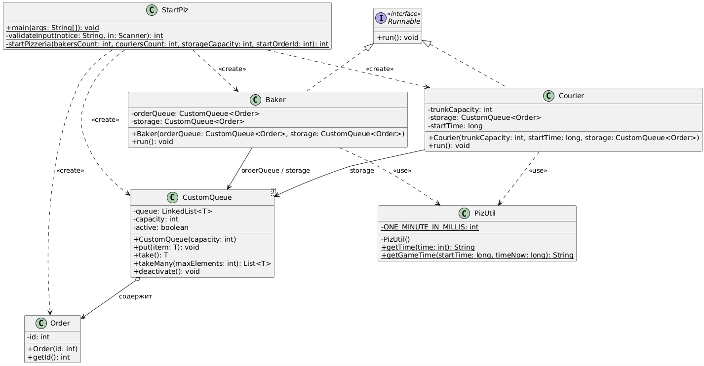

# Пиццерия

Модель пиццерии. Пиццерия представлена в виде набора пекарей и курьеров. Заказ пиццы попадает в очередь заказов.
Повар берет следующий заказ. Далее заказ поступает на склад. Курьер его забирает и выполняет доставку.

## Структура классов

Структура классов представлена на следующей диаграмме

**Диаграмма 1.** Классы Courier и Baker наследуются от Runnable и запускаются каждый в своем потоке.
Запуск потоков происходит в классе StartPiz.  Очередь заказов (orderQueue) и склад (storage)
реализуются в виде CustomQueue. Заказ представлен в виде класса Order.